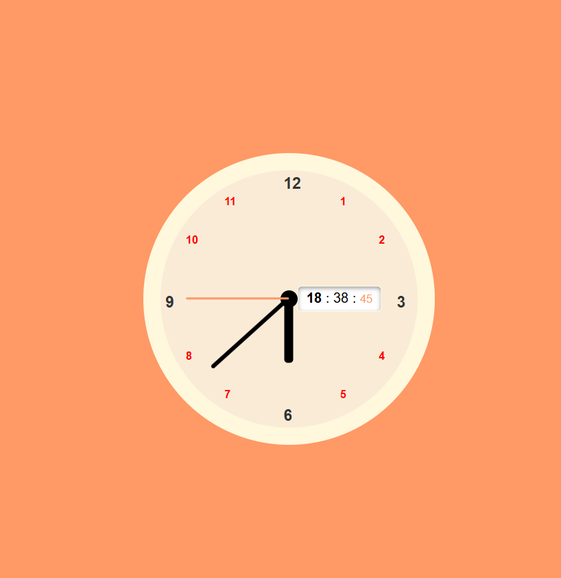

# Analog & Digital Clock UI 🕒

A modern analog and digital clock interface built with HTML, CSS, and JavaScript. It features animated clock hands, a digital time display, and neatly positioned hour markers.

## 🔧 Features
- Animated **hour**, **minute**, and **second** hands
- Real-time **digital clock** display
- Visually aligned **hour markers (1–12)**
- Clean, responsive UI using only HTML/CSS/JS

## 📸 Preview
 <!-- Optional: Add a screenshot to your repo -->

## 🚀 Getting Started

### 1. Clone the repository
```bash
git clone https://github.com/yourusername/analog-digital-clock.git
cd analog-digital-clock
